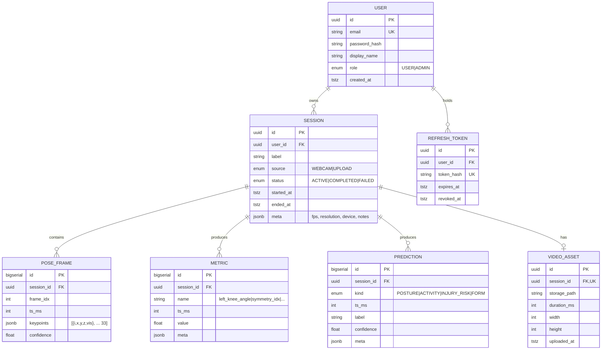

# Database Schema

PostgreSQL 16, managed via Prisma (`backend/prisma/schema.prisma`).

Sprint AI v2 adds the `Athlete` table and the `Athlete ↔ Session` link.
See [`SPRINT_AI_V2.md`](SPRINT_AI_V2.md) §3 for the rationale and the
metric-naming convention (`summary.*` vs `sprint.*`).

## ER diagram



## Index strategy

| Table | Index | Reason |
|---|---|---|
| `user(email)` | unique | login lookup |
| `refresh_token(token_hash)` | unique | rotation check |
| `refresh_token(user_id, expires_at)` | btree | cleanup queries |
| `session(user_id, started_at DESC)` | btree | "my recent sessions" |
| `pose_frame(session_id, frame_idx)` | btree | sequential scan during replay |
| `metric(session_id, name, ts_ms)` | btree | charting queries |
| `prediction(session_id, kind, ts_ms)` | btree | filtered timelines |

## Retention

- `pose_frame` is the largest table by volume. We persist **every 5th frame**
  (~6 fps) by default; raw 30 fps stays in Redis only.
- A nightly job (`backend/src/jobs/retention.js`) deletes `pose_frame` rows
  older than `POSE_RETENTION_DAYS` (default 90).

## Migrations

```bash
cd backend
npx prisma migrate dev --name init      # creates a new migration
npx prisma migrate deploy               # applies in prod / CI
npx prisma studio                       # browse the DB
```
